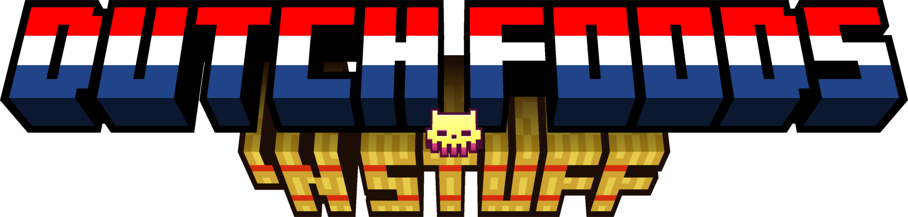

# This mod adds a bunch of typical Dutch things and things associated with the Dutch.

**It currently adds:**
- Cheese
- Cheese blocks
- Cheese slices & slicer
- Clogs
- Stroopwafel
- Kale

**Possibly going to be added:**

- Tullip clusters
- Bitterballen
- **_More_**

Credits:
* **Fabric Docs** For their amazing documentation on fabric modding!
* **Kaupenjoe** For making great youtube modding  
* **ElectricSteve** for helping with hard stuff TYSM!!
* **Farmer's Delight / Vectorwing** For their block/crop_cross.json file which was useful for me.
